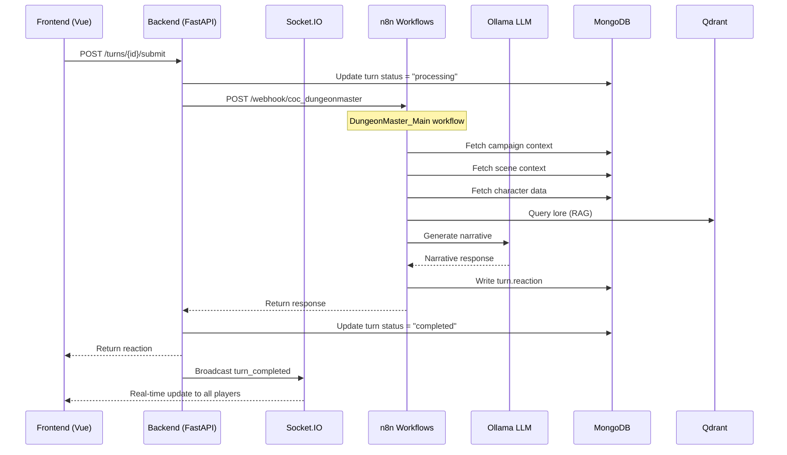

# Data Flow

> **Last Updated:** 2024-11-29  
> **Status:** Phase 1 - Understanding

## Primary Flow: Turn Submission



---

## State Ownership Map

| State | Owner | Persistence | Notes |
|-------|-------|-------------|-------|
| World, Realm, Campaign | Backend | MongoDB | Rarely changes |
| Chapter, Scene | Backend | MongoDB | Created by n8n, managed by backend |
| Turn | Backend | MongoDB | Created by backend, reaction added by n8n |
| Turn.actions | Frontend → Backend | MongoDB | Player input |
| Turn.reaction | n8n → Backend | MongoDB | AI-generated narrative |
| ActionDraft | Frontend | MongoDB (temp) | Cleared after turn submission |
| Player presence | Socket.IO | In-memory | Lost on restart |
| Session state | Backend | MongoDB | Active session tracking |
| LLM context | n8n | Ephemeral | Built per-request, not persisted |

---

## Data Flow Paths

### 1. Turn Processing (DungeonMaster)

```
Frontend
   │
   ▼ POST /api/v1/turns/{id}/submit
Backend (routes_turns.py)
   │
   ▼ HTTP POST to n8n webhook
n8n (DungeonMaster_Main)
   │
   ├──► MongoDB: Fetch campaign, scene, characters
   ├──► Qdrant: Fetch relevant lore
   ├──► Dice Roller: Roll skill checks if detected
   │
   ▼ LLM Synthesizer
Ollama
   │
   ▼ Generated narrative
n8n
   │
   ▼ Write to MongoDB (turn.reaction)
Backend
   │
   ▼ Return to frontend + Socket.IO broadcast
```

### 2. Prophet Q&A

```
Frontend
   │
   ▼ POST /api/v1/ai/prophet
Backend (routes_ai.py)
   │
   ▼ HTTP POST to n8n webhook
n8n (Prophet_Main)
   │
   ├──► Intent classification
   ├──► Route to: MongoDB (character/history) OR Qdrant (rules/lore)
   │
   ▼ LLM Synthesizer
Ollama
   │
   ▼ Answer
Backend
   │
   ▼ Return to frontend
```

### 3. Real-time Updates (Socket.IO)

```
Backend event (turn completed, player joined, etc.)
   │
   ▼ socketio_manager.py
Socket.IO server
   │
   ▼ Emit to room: "session:{session_id}"
All connected clients in session
```

---

## Critical Handoff Points

| From | To | Mechanism | Potential Issues |
|------|-----|-----------|------------------|
| Backend → n8n | HTTP webhook | Timeout (60s), no retry |
| n8n → MongoDB | Direct connection | Duplicate writes possible |
| n8n → Backend | HTTP response | State sync issues |
| Backend → Frontend | Socket.IO | Connection drops |

---

## What n8n Currently Owns (that backend could own)

1. **Scene/Chapter creation logic** - n8n decides when to create new scenes
2. **Context assembly** - n8n fetches campaign/scene/character data
3. **Skill check detection** - n8n parses actions for skill mentions
4. **Turn reaction writing** - n8n writes directly to MongoDB

---

## What Backend Currently Owns

1. **Entity CRUD** - All standard create/read/update/delete
2. **Turn lifecycle** - Create, submit, status tracking
3. **Session management** - Active sessions, player tracking
4. **Real-time presence** - Socket.IO events
